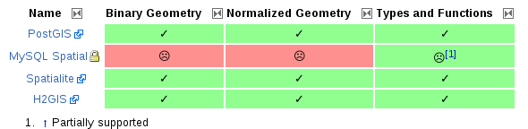

.. _bases de datos:

**************
Bases de datos
**************

Autores
----------

- |delawen|

Introducción
---------------

Una base de datos espacial es una base de datos que se ha optimizado para almacenar y consultar datos que representa los objetos definidos en un espacio geométrico. La mayoría de las bases de datos espaciales permiten representar objetos geométricos simples, tales como puntos, líneas y polígonos. Algunas bases de datos espaciales manejan estructuras más complejas, tales como objetos en tres dimensiones, coberturas topológicas, redes lineales, y TIN.

Aunque a día de hoy existen bases de datos NoSQL que también empiezan a soportar funcionalidades geométricas, en este artículo vamos a centrarnos únicamente en las bases de datos clásicas, dado que son las que tienen, con mucha diferencia, la implementación más madura.

En la siguiente tabla se presentan las características principales de los productos revisados en el contexto de este trabajo. Se puede consultar más información sobre la estructura de la tabla en la  :ref:`introducción <info-tabla>`.

.. figure:: imgs/tabla-principal.png
   :align: center
   :alt: Información general sobre servidores

   Información general sobre servidores

   Implementación de estándares OGC

.. important:: Se puede consultar la versión más reciente, así como los enlaces asociados y anotaciones en la sección de `Bases_de_datos`_ del wiki de OSGeo.

.. _Bases_de_datos: http://wiki.osgeo.org/wiki/Panorama_SIG_Libre_2014/Bases_de_datos

Software
----------

En esta sección se describirá brevemente cada uno de los productos evaluados en esta comparativa. El orden de aparición es cronológico, empezando por los proyectos más veteranos.

MySQLSpatial_:
  Siendo la extensión para la base de datos más extendida de la lista, su instalación y manejo es muy sencillo. Es una base de datos que se encuentra por defecto en la mayoría de servicios de hosting y por tanto suele ser la puerta de entrada de muchos desarrolladores. Sin embargo, su falta de compatibilidad con los estándares hace que el código no sea fácilmente portable a otras plataformas.

PostGIS_:
  Basado en `postgres`_, esta potente base de datos multiplataforma es totalmente compatible con OGC. Aunque su uso a nivel general no está tan extendido como MySQL, dentro del sector GIS su uso es casi canónico.

  .. _postgres: http://www.postgresql.org.es/

Spatialite_:
  Al estar basada en `SQLite`_, es una base de datos basada en ficheros, lo que simplifica en gran medida su uso y distribución. Esta extensión es candidata para formar parte de `Geo Package`_, un nuevo formato abierto de OGC para almacenar y transferir datos geográficos.

  .. _SQLite: https://sqlite.org/
  .. _Geo Package: http://www.geopackage.org/

H2GIS_:
  `H2`_ es una base de datos Java ligera, con gran facilidad de instalación y distribución. Basada también en ficheros, se distingue de Spatialite porque contiene un servidor que permite varias conexiones concurrentes a la misma.

  .. _H2: http://www.h2database.com/html/main.html

Puntos calientes
------------------

El Open Geospatial Consortium (OGC) ha desarrollado el estándar Simple Feature y establece normas para las funcionalidades espaciales de los sistemas de bases de datos. También llamada norma ISO 19125, se presenta en dos partes:

La primera parte, la norma ISO 19125-1 (SFA-CA para la "arquitectura común"), define un modelo de características simples de dos dimensiones, con interpolación lineal entre vértices. El modelo de datos definido en SFA-CA es una jerarquía de clases. Esta parte también define la representación utilizando WKT (well known text) y WKB (well known binary). Este tipo de datos contiene no sólo las coordenadas del objeto a representar, sino que también contiene referencias a la proyección utilizada y otras características que pudieran resultar de interés a la hora de operar con dichas geometrías.

La segunda parte de la norma ISO 19125-2 (SFA-SQL), define una serie de funcionalidades utilizando SQL. Estas funcionalidades abarcan la mayoría de las operaciones típicas que pueden llevarse a cabo con datos geográficos:

* Mediciones Espaciales: Para calcular la longitud de una línea, el área de un polígono, la distancia entre geometrías,...
* Funciones Espaciales: Modificar geometrías existentes para crear nuevas, es decir, operar con geometrías para obtener nuevas geometrías (intersección, buffering,...)
* Predicados Espaciales: Devuelven un booleano (verdadero/falso) acerca de la condición de una o más geometrías espaciales. Por ejemplo, si dos geometrías interseccionan o si están dentro de un buffer.
* Creación de Geometrías: Normalmente en base a una lista de coordenadas, se genera una nueva geometrías.
* Descripción de Geometrías: Devuelven información específica acerca de una geometría, por ejemplo qué punto es el centro de un círculo.

Curva de aprendizaje y conocimientos previos
------------------------------------------------

Dado que la mayoría de las bases de datos con extensiones espaciales siguen un mismo estándar, la programación y uso de dichas extensiones es muy similar de una plataforma a otra.

Documentación
----------------

A continuación se ofrecen enlaces a las principales páginas de documentación, tutoriales o ejemplos que pueden ayudar a empezar a trabajar con cada uno de los productos revisados.

.. list-table:: Documentación de proyectos
   :widths: 10 10 10 35
   :header-rows: 1

   * - Proyecto
     - Documentación
     - OSGeo Live
     - Otros

   * - **MySQL Spatial**
     - `MySQL Spatial docs <https://dev.mysql.com/doc/refman/5.0/en/spatial-extensions.html>`_
     - 
     - `introducción a MySQL Spatial <http://howto-use-mysql-spatial-ext.blogspot.com.es/>`_

   * - **postGIS**
     - `postGIS docs <http://postgis.net/docs/manual-2.1/>`_
     - `postGIS qs <http://live.osgeo.org/en/quickstart/postgis_quickstart.html>`_
     - `postGIS introduction <http://workshops.boundlessgeo.com/postgis-intro/>`_

   * - **H2GIS**
     - `H2GIS docs <http://www.h2gis.org/docs/dev/home/>`_
     - 
     - `quickstart <http://www.h2gis.org/docs/dev/quickstart/>`_

   * - **Spatialite**
     - `Spatialite docs <https://www.gaia-gis.it/spatialite-2.3.1/spatialite-manual-2.3.1.html>`_
     - 
     - `KISS spatialite in 5 minutes <http://www.camptocamp.com/actualite/kiss-spatialite-in-5-minutes/>`_

.. only:: html

.. Enlaces a webs de  proyectos

.. _postGIS: http://postgis.net/
.. _H2GIS: http://www.h2gis.org/
.. _MySQLSpatial: http://dev.mysql.com/doc/refman/5.7/en/gis-introduction.html
.. _Spatialite: http://www.gaia-gis.it/gaia-sins/
