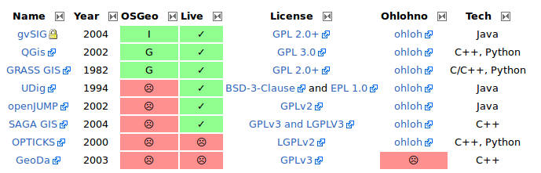
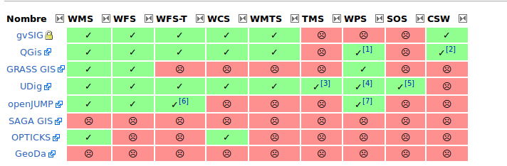

********
Clientes
********

Autores
-------

- |jsitjar|
- |rantolin|

Introducción
------------

Entendemos por Clientes al conjunto de aplicaciones SIG de Escritorio, es decir, aplicaciones en las que se implementan herramientas para llevar a cabo las tareas básicas del trabajo con datos geográficos:
creación o edición, manejo y análisis. Con esta filosofía fueron desarrollados los primeros programas SIG, especialmente para el tratamiento y análisis de datos geográficos, y posteriormente, para dotar a estos de mayor versatilidad, incorporando otras funciones adicionales que facilitaran el trabajo con esos mismos datos. 

Los SIG de escritorio siguen manteniendo su posición como aplicaciones fundamentales, y hablar genéricamente de un SIG implica por lo general hacerlo de una aplicación de escritorio antes que de otros tipos de aplicaciones. 
Por otra parte, las herramientas de escritorio son soluciones en general completas que cubren la totalidad de necesidades que se presentan en el desarrollo de proyectos SIG, y por ello constituyen las herramientas primordiales para llevar estos a cabo. 
Ofrecen un gran numero de herramientas para gran diversidad de usuarios en diversidad de campos. 

Veamos con un poco más de detalle las principales funcionalidades de los SIG de Escritorio:

- **Entrada y salida de datos**: Todas las aplicaciones SIG de escritorio deben obligatoriamente implmentar capacidades para leer datos y, opcionalmente, guardarlos. Pese a ser de tal importancia, la implementación de las capacidades de entrada y salida es muy variable en unos u otros SIG. Una razón por la que esto sucede es el gran número de formatos de fichero distintos. Así, cada SIG de escritorio es capaz de abrir unos u otros formatos de archivo, y mientras que algunas tratan a todos ellos por igual, ciertas aplicaciones trabajan en un formato propio con carácter nativo y son capaces de incorporar datos en otros formatos a través de extensiones o funciones de conversión entre estos y el formato particular del programa. Cabe destacar también la capacidad de conexión a bases de datos o servicios remotos que ofrecen algunos softwares (ahora la mayoría).

- **Visualización**: La visualización es una función fundamental dentro de los SIG y del trabajo con cartografía en general. La gran mayoría de las herramientas de escritorio incluyen un gran número de elementos para representar los datos geográficos con los que se trabaja. En ocasiones, interesa únicamente crear una representación de los datos, pero incluso cuando el trabajo con una herramienta SIG está enfocado a la realización de un análisis, la visualización y exploración visual de los datos de partida es un paso previo. En general, la forma de operar con los elementos de visualización es muy similar entre soluciones SIG distintas y, a diferencia de lo que sucede con la implementación de otras funcionalidades, el manejo es prácticamente igual.  

- **Análisis**: Posiblemente, una de las funcionalidades más destacadas y significativas de un SIG de Escritorio. La tendencia actual es considerar las capacidades de análisis como herramientas modulares que se ejecutan sobre una plataforma base, la cual comprende las capacidades de visualización y entrada y salidad de datos. Todas estas capacidades de análisis son independientes entre sí, auqnué pueden coordinarse y emplearse en conjunto para alcanzar un resultado concreto. 

- **Edición**: Funcionalidades que permiten modificar y corregir los datos geográficos con los que se trabaja en un SIG. Las operaciones de edición pueden emplearse para la actualización de cartografía, pero también para la creación de nuevas capas, que pueden crearse a partir de la digitalización de imágenes o a partir de cualquier otra capa de la que se disponga. Puede distinguirse entre diversas formas de edición: Edición de geometrías de una capa vectorial, edición de atribuos en una capa vectorial, edición de valores en una capa raster. Fundamentalmente, estas capacidades permiten la composición de documentos cartográficos de acuerdo con un diseño dado. En la elaboración del diseño, pueden emplearse todos los elementos que habitualmente podemos encontrar en un mapa: el propio mapa en sí, leyenda, título, escala, orientación, etc.

- **Generación de cartografía**: Capacidades de creación de cartografía impresa, para generar documentos que puedan posteriormente imprimirse y emplearse como una mapa cásico. Las razones para la existencia de tales funcionalidades son muchas, pero la principal sigue siendo la necesidad que aún existe de apoyarse en este tipo de documentos cartográficos para poder incorporarlos a proyectos o estudios como parte de anexos cartográficos. 

*(Fuente: Olaya, V. 2012. Libro Libre SIG.)*

Los clientes de escritorio ofrecen un amplio rango de aplicaciones, desde simples visualizadores a software de creación de mapas y análisis y tecnología punta en sistemas de edición y análisis profesional. 

En la siguiente tabla se presentan las características principales de los productos revisados en el contexto de este trabajo. 

   Información general sobre tecnologías

   Implementación de estándares OGC

Breve descripción de la sección con retrospectiva y evolución incluyendo la tabla de la sección.

Software
--------

En esta sección se describirá brevemente cada uno de los productos evaluados en esta comparativa. 

gvSIG_:

GvSIG es un proyecto de desarrollo de Sistemas de Información Geográfica en software libre, que incluye principalmente las aplicaciones gvSIG Desktop y gvSIG Mobile. 
La aplicación gvSIG Desktop fue la primera que se desarrolló dentro del proyecto gvSIG, por lo que también se conoce abreviadamente como gvSIG. 
Este proyecto fue desarrollado por el gobierno local de la Comunidad Valenciana (Generalidad Valenciana) de España, con el objetivo inicial de realizar la gestión de datos geográficos de esa colectividad; precisamente la sigla gvSIG abrevia la denominación Generalitat Valenciana Sistema de Información Geográfica.

.. _gvSIG: http://www.gvsig.org/web

QGIS_

Es un Sistema de Información Geográfica que nació en mayo de 2002 y se estableció como proyecto en SourceForge en junio del mismo año. Fue además uno de los ocho primeros proyectos de la fundación OSGeo.
Se trata de una aplicación de escritorio que pretende ofrecer a usuarios con necesidades básicas un entorno sencillo y agradable. 

.. _QGIS: http://www.qgis.org/en/site/

GRASS_

Proyecto ya muy veterano, anterior al nacimiento del FOSS, que el **CERL** (*Construction Engineering Research Laboratory*) comenzó a desarrollar ante la necesidad de gestionar la gran cantidad de recursos naturales a cargo del ejército en los Estados Unidos.
Actualmente, la infraestructura principal se gestiona entre el Instituto de Cultura de Trento y el *Geselleschaft für Datenanalyse und Fernerkundung* (GDF) de Hannover. 
La principal característica de GRASS es su gran número de funcionalidades, derivadas de todos los años de desarrollo y de la estructura modular del programa, que favorece que los desarrolladores aporten al proyecto contribuciones individuales. Por otro lado, el mayor problema de cara a su difusión y adopción es su complejidad y su pronunciada curva de aprendizaje. Aun siendo un software muy potente, carece de una interfaz gráfica amigable.

.. _GRASS: http://grass.osgeo.org/

UDig_

Este proyecto está desarrollado por la empresa canadiense Refractions Research Inc, y tiene como principal objetivo ofrecer un cliente de escritorio que soporte el mayor número de fuentes de datos tanto locales como remotas, y especialmente las basadas en protocolos OGC.
Aunque presenta únicamente capacidades de análisis y edición vectorial, el proyecto JGrass_ añade capacidades ráster adaptadas desde GRASS (con especial énfasis en las relacionadas con análisis del terreno y similares).

.. _UDig: http://udig.refractions.net/
.. _JGrass: https://code.google.com/p/jgrass/

OpenJUMP_

JUMP (*Java Unified Mapping Platform*) fue uno de los primeros proyectos de cliente GIS de escritorio en el lenguaje Java. Destaca por hacer uso de la biblioteca JTS_ para poder realizar algunas operaciones de análisis espacial, así como el soporte del formato GML_ y el protocolo WMS desde sus aparición.
Este proyecto fue liderado por Vivid Solutions1 pero dada la política de aceptación de contribuciones externas por parte de la empresa motivó la aparición de un nuevo proyecto derivado (llamado fork  en el ámbito FOSS) conocido como The JUMP Pilot Project (JPP) que pretende coordinar de forma más democrática las contribuciones de diferentes equipos de desarrollo para evitar duplicidad de esfuerzos.

Esto último es especialmente importante, ya que es destacable la cantidad de proyectos derivados que han surgido a partir de él:

- Open JUMP
- Open JUMP *Viatoris*
- DeeJUMP
- SkyJUMP
- PirolJUMP
- Kosmo

.. _OpenJUMP: http://www.openjump.org/
.. _JTS: http://www.vividsolutions.com/jts/JTSHome.htm
.. _GML: http://www.opengeospatial.org/standards/gml

Kosmo_

En España destaca el proyecto Kosmo, desarrollado por la empresa SAGE, que pretende incorporar a la plataforma JUMP otros desarrollos de interés realizados en otros proyectos. El cliente de escritorio Kosmo permite explorar, editar y analizar datos espaciales desde gran variedad de bases de datos, formatos vectoriales y formatos raster. Además, cumple los estándares OGC y proporciona una excelente integridad topológica. Su arquitectura de extensiones permite personalizarlo fácilmente para fines específicos.

.. _Kosmo: http://www.opengis.es/

`SAGA GIS <http://www.saga-gis.org/en/index.html>`_:

Esta herramienta se ha desarrollado sobre todo en Gottingen, Alemania. Se trata de un GIS de escritorio para Windows con una clara separación entre su interfaz de programación (API) y su interfaz de usuario. De hecho la primera tiene una licencia LGPL y la segunda es GPL. Esto permite realizar módulos *cerrados* sin incumplir ninguna licencia. 
Este software destaca especialmente por su orientación a la realización de análisis de imágenes y modelos digitales del terreno.

OPTICKS_:
Opticks es una herramienta para el análisis de imágenes y datos de teledetección. Es muy similar en funcionalidad y propósito a las herramientas comerciales *ERDAS Imagine*, *RemoteView*, *ENVI* o *SOCET GXP*. Opticks tiene funcionalidades del tipo GIS (como la utilización de shapefiles), pero principalmente está pensado para el anánisis de imágenes y vídeo o, de manera más general, el análisis de datos raster.

.. _OPTICKS: http://opticks.org/confluence/display/opticks/Welcome+To+Opticks

GEODA_:

GeoDa es el principal programa desarrollado dentro de `Centro GeoDa`_. Está diseñado para implementar técnicas para el análisis exploratorio de datos espaciales. Proporciona una interfaz gráfica amigable para  el uso de métodos de análisis de datos espaciales descriptivos, realización de estadísticas de autocorrelación espacial y regresiones espaciales básicas, análisis de datos espacio-temporales de datos, y visualización 3D.

.. _GEODA: http://geodacenter.asu.edu/
.. _Centro GeoDa: http://geodacenter.asu.edu/

TILEMILL_:
TileMill es una herramienta pensada para diseñar y crear mapas para su visualización via web de una manera rápida y fácil. Está construido sobre la biblioteca de renderizado, Mapnik_, la misma que utilizan tanto OpenStreetMap_ como MapQuest_. **TileMill** no pretende ser una herramienta de cartografía de uso general, sino que se centra en la racionalización y simplificación de un conjunto limitado de casos de uso.

.. _TILEMILL: https://www.mapbox.com/tilemill/
.. _Mapnik: http://mapnik.org/
.. _OpenStreetMap: http://www.openstreetmap.org/
.. _MapQuest: http://www.mapquest.es/

Puntos calientes
----------------

Durante los últimos años el software SIG de escritorio ha dominado, pero se prevé que en la próxima década los servidores SIG o SIG web sean el producto dominante. 

Dentro de la sección, hacia donde se está moviendo la comunidad.

Curva de aprendizaje y conocimientos previos
--------------------------------------------

Metería otra tabla con los conocimientos previos necesarios para trabajar con y en cada software.

Documentación
-------------

Empezar a trabajar con cualquier software siempre es un reto y, como hemos visto, en algunas ocasiones puede resultar incluso una tarea árdua. En algunas ocasiones esto se debe porque tampoco sabemos dónde encontrar una guía de inicio amena o tan siquiera la documentación. Este apartado intenta cubrir este hueco, pretende ser un conjunto de enlaces tanto a la documentación oficial como a una serie de tutoriales y ejemplos de los distintos proyectos.

.. list-table:: Documentación de proyectos
   :widths: 10 10 10 35
   :header-rows: 1

   * - Proyecto
     - Documentación
     - OSGeo Live
     - Otros

   * - **GRASS GIS**
     - `GRASS docs <http://grass.osgeo.org/grass70/manuals/index.html>`_
     - `GRASS qs <http://live.osgeo.org/en/quickstart/grass_quickstart.html>`_
     - `Tutoriales <http://grass.osgeo.org/documentation/tutorials/>`_; `Primera vez con GRASS <http://grass.osgeo.org/documentation/first-time-users/>`_

   * - **uDig**
     - `uDig docs <http://udig.github.io/docs/user/>`_
     - `MapServer qs <http://live.osgeo.org/en/quickstart/udig_quickstart.html>`_
     - `Canal de vídeos en YouTube <https://www.youtube.com/user/udiggis>`_

   * - **OPTIKS**
     - `Notas de instalación y uso <http://opticks.org/confluence/display/opticks/Opticks+HOWTOs>`_
     -
     -

   * - **openJUMP**
     - `openJUMP docs <http://sourceforge.net/projects/jump-pilot/files/Documentation/OpenJUMP%201.6%20Docs/>`_
     - `openJUMP qs <http://live.osgeo.org/en/quickstart/openjump_quickstart.html>`_
     -

   * - **QGIS**
     - `QGIS docs <http://qgis.org/es/docs/user_manual/index.html>`_
     - `QGIS qs <http://live.osgeo.org/en/quickstart/openjump_quickstart.html>`_
     - `Tutorial (español) <http://www2.pr.gov/agencias/gis/seccioneducativa/Pages/Tutorial_Quantum_GIS.aspx>`_; `Tutorial oficial (inglés) <http://www.qgis.org/en/docs/training_manual/index.html>`_

   * - **GeoDa**
     - `GeoDa docs <http://geodacenter.asu.edu/software/documentation>`_
     -
     - `Tutoriales y vídeos demostrativos <http://geodacenter.asu.edu/og_tutorials>`_

   * - **gvSIG**
     - `gvSIG docs <http://www.gvsig.org/plone/projects/gvsig-desktop/docs/user/gvsig-desktop-2-1-manual-de-usuario/>`_
     - `gvSIG qs <http://live.osgeo.org/en/quickstart/gvsig_quickstart.html>`_
     - `Videotutoriales <http://edugvsig.blogspot.co.uk/p/gvsig.html>`_

   * - **SAGA GIS**
     - `SAGA GIS docs <http://sourceforge.net/projects/saga-gis/files/SAGA%20-%20Documentation/SAGA%202%20User%20Guide/>`_
     - `SAGA GIS qs <http://live.osgeo.org/en/quickstart/saga_quickstart.html>`_
     - `Tutoriales <http://sourceforge.net/apps/trac/saga-gis/wiki/Tutorials>`_

   * - **TileMill**
     - `TileMill docs <https://www.mapbox.com/tilemill/docs/crashcourse/introduction/>`_
     - `TileMill qs <http://live.osgeo.org/en/quickstart/tilemill_quickstart.html>`_
     - `Guía de la interfaz <https://www.mapbox.com/tilemill/docs/manual/interface-tour/>`_