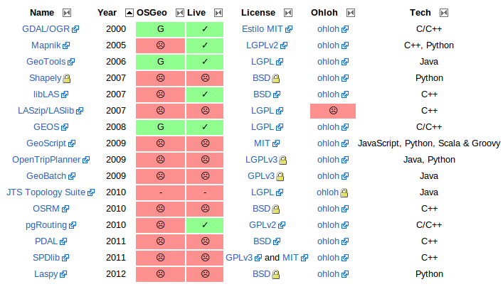

.. _librerias:

*********
Librerías
*********

.. todo:: Sección por completar. Discusión del contenido en la :issue:`9`

Autores
-------

- |alediator|
- |rantolin|
- |shiguera|

Introducción
------------

En esta sección se va a cubrir todo el conjunto de paquetes que ofrecen funcionalidades avanzadas para cualquier sistema de información en la forma de librerías. Como se verá, algunos de estos proyectos han cogido protagonismo a lo largo del tiempo ofreciendo no sólo una interfaz de programación (o API en inglés), si no también un conjunto de herramientas propias. Dado el gran abanico que representan, se dividirá esta sección en otras cuatro secciones en las que se agrupan librerías con características y funcionalidades similares. Así, tendremos la siguiente división:

- **Geoprocesamiento**: Aquí se incluyen todas las herramientas y librerías que proporcionan métodos para la manipulación de información geoespacial como  GDAL/OGR, GEOS, JTS/GeoTools, Geoscript o Shapely.
- **Routing**: Estas librerías ofrecen enrutamiento geoespacial y funcionalidad de análisis de redes. Comprendemos aquí las librerías OSRM, pgRouting y OpenTripPlanner 
- **LiDAR**: Aquí se hablará sobre aquellas librerías y conjunto de herramientas capaces de trabajar con datos LiDAR_. Destacan en esta categoría las librerías libLAS, LASlib/LASzip, SPDlib, PDAL y LASpy.
- **Varios**: Por último, consideramos dos librerías aisladas, una para el renderizado como Mapnik y otra para la automatización procesos para la publicación de información como GeoBatch.

.. _LiDAR: http://es.wikipedia.org/wiki/LIDAR

La siguiente tabla muestra las principales características las librerías tratadas en este artículo. Información detallada sobre la estructura de la tabla se encuentra en la :ref:`introducción <info-tabla>`.

.. important:: Se puede consultar la versión más reciente, así como los enlaces asociados y anotaciones en la sección de `Librerías`_ del wiki de OSGeo.

.. _Librerías: http://wiki.osgeo.org/wiki/Panorama_SIG_Libre_2014/Librer%C3%ADas#Main_information

Software
--------

Cualquier librería LiDAR presentada en este documento se puede utilizar para la transformación de formatos láser, pero quizás la más adecuada para ello es PDAL, ya que está pensada especialmente para ello. Es más, PDAL trata de mejorar la librería libLAS cuyo desarrollo lleva parado algún tiempo. A su vez, libLAS se generó a partir de una versión anterior de LASlib, aunque estas últimas han seguido evolucionando hacia una potente herramienta de procesado. Cabe notar, para evitar equívocos, que la librería LASlib es completamente libre, mientras que las herramientas (LASTools) tienen el código cerrado pero su utilización está autorizada para usos no comerciales. Además de lectura y escritura de datos y la transformación entre formatos, SPDlib incorpora herramientas para procesar y analizar datos y para generar modelos digitales de elevación. Por último, LASzip es la única librería capaz de leer y escribir datos LiDAR en formato LAZ. Éste es un tipo de formato comprimido pero con las mismas especificaciones que el formato LAS.

El procesamiento de datos es, en general, *la recogida y manipulación de elementos de datos para producir información significativa*. Así pues, a través del **geoprocesamiento**, se manipulan los datos espaciales con el objetivo de presentarlos en un contexto específico. En cuanto al procesamiento de datos vectoriales aparecen dos tendencias claras: una serie de librerías orientadas a la generación de scriptlets de forma intuitiva y sencilla (GeoScript/Shapely); y librerías clásicas de geoprocesamiento a nivel servidor (GEOS/JTS/GeoTools). 

`Shapely`_ ** es un paquete de algoritmos para procesamiento espacial 2D escrito en Python.

.. _Shapely: https://github.com/sgillies/shapely

`GeoScript`_ añade capacidades espaciales a los lenguajes dinámicos como JavaScript, Python, Scala o Groovy.

.. _GeoScript: http://geoscript.org/

`JTS`_ Topology Suite** es una librería escrita 100% en Java que implementa la `SFA`_ y permite operar con geometrías incorporando una buena colección de algoritmos espaciales 2D. El rendimiento es elevado permitiendo la utilización de sus algoritmos en entornos de producción. 

.. _JTS: http://www.vividsolutions.com/jts/JTSHome.htm

`Geotools`_ es una librería 100% Java con todo tipo de herramientas para procesamiento y visualización de contenidos geoespaciales. Implementa la mayoría de estándares del OGC. El procesamiento espacial lo realiza embebiendo JTS. Añade la posibilidad de trabajar con Sistemas de Referencia y acceder a bases de datos. Es parte del backend utilizado por Geoserver.

.. _Geotools: http://www.geotools.org/

`GEOS`_ es una versión C++ de la librería *JTS Topology Suite*

.. _GEOS: http://trac.osgeo.org/geos/

`GDAL`_ se suele utilizar como complemento de todas las demás herramientas para la preparación de imágenes ráster de forma que mejoren el rendimiento al ser servidas.

`GeoBatch`_ da un paso más allá en el geoprocesamiento, permitiendo la definición de ciertos flujos de procesamiento y permitiendo la ejecución de los mismos en background a través de distintos roles y usuarios (así como la ejecución programada de los mismos).

.. _GeoBatch: http://geobatch.geo-solutions.it/

`Mapnik`_ es una herramienta para el renderizado de mapas atractivos, con bordes de geometrías limpios y suaves, provisto de un sistema gráfico con anti-aliasing de calidad, posicionamiento inteligente de etiquetas, y simbolización SVG escalable. La mayor fama de mapnik viene por ser utilizado como render de la capa principal de Open Street Map.

.. _Mapnik: http://mapnik.org/

En relación con el routing o cálculo de rutas, mencionamos en este grupo las librerías **pgRouting**, **OSRM** y **OpenTripPlanner**. 

`pgRouting`_ es una extensión de la base de datos espacial Potgres-PostGIS que añade funcionalidades de routing, esto es, de cálculo de rutas y caminos mínimos a través de los distintos algoritmos. 

.. _pgRouting: http://pgrouting.org/

`OSRM`_ Es una librería escrita en C++ que proporciona algoritmos de camino mínimo y herramientas de routing utilizando la cartografía de OpenStreetMap como red de caminos. 

.. _OSRM: http://project-osrm.org/

`OpenTripPlanner`_ ofrece una API REST que permite el cálculo de rutas basadas el distintos métodos de transporte (incluyendo parámetros como el alquiler de bicicletas o el transporte público).

.. _OpenTripPlanner: http://www.opentripplanner.org/

Puntos calientes
----------------

.. todo:: Queda hablar de routing

Últimamente, la tecnología LiDAR está en auje y cada vez aparecen más librerías que ofrecen la posibilidad de trabajar con datos LiDAR en el formato LAS_. Algunas también incorporan conjuntos herramientas para el procesado y análisis de datos. Estas herramientas suelen aparecer como comandos de consola para favorecer el desarrollos de *scripts*. Con el objetivo de favorecer la creación de sencillos programas, los esfuerzos se están centrando en incorporan *bindings* en python. Para permitir un uso más sencillo y cómodo la comunidad está haciendo esfuerzos en la creación interfaces gráficas y en la incorporación de forma nativa de lectura y escritura de datos láser en clientes de escritorio como QGIS o GRASS. 

.. _LAS: http://www.asprs.org/Committee-General/LASer-LAS-File-Format-Exchange-Activities.html

Respecto al **geoprocesamiento**, probablemente, los avances más significativos se están realizando en la abstración de las librerías clásicas con el objetivo de facilitar su uso de cara a los desarrolladores. Dentro de este grupo se enmcuentran GeoScript, Shapely o  GeoBatch. 

Mapnik se suele embeber típicamente en aplicaciones python que publican mapas en Internet, aunque las últimas mejoras incorporadas han permitido que Mapnik también se utilice para crear mapas de alta resolución en papel.

Curva de aprendizaje y conocimientos previos
--------------------------------------------

.. note:: Metería otra tabla con los conocimientos previos necesarios para trabajar con y en cada software.
.. todo:: Queda hablar del los otros grupos de librerías

Para trabajar con las librerías LiDAR es conveniente tener conocimientos de C++, ya que es el lenguaje común a todas ellas. Aunque existen ya interfaces gráficas para trabajar con estas herramientas, el módo más rápido y versátil es la línea de comando y la utilización de *scripts* o incluso la programación en Python. Por tanto, tener experiencia en estos campos facilitaría su utilización. Escribir en la consola nunca es agradable para cualquier persona que empieza, pero la mayor ventajan que presentan es que todas las herramientas tienen las mismas funcionalidades y es muy intuitivo aprender el lenguaje utilizado en cualquiera de ellas si se adquieren conocmientos previos en alguna otra librería. 

En cuanto al **geoprocesamiento**, los conocimientos necesarios son distintos según la(s) librería(s) que quieras usar. Para todas necesitarás conocimentos acerca del modelo `SFA`_. A no ser que necesites una funcionalidad específica de una de las librerías, podrás elegir aquella que se adecúe más a tus conocimientos. Los programadores en C++ pueden utilizar GEOS, mientras que los programadores Java encontrarán en JTS y Geotools las herramientas de geoprocesamiento necesario. Python dispone de GeoScript, Shapely como herramientas específicas del lenguaje.

.. _SFA: http://www.opengeospatial.org/standards/sfa

Documentación
-------------

A continuación se enumeran una serie de enlaces a páginas de documentación, tutoriales o ejemplos que pueden ser de ayuda para trabajar con estas librerías:

.. list-table:: Documentación de proyectos
   :widths: 10 10 10 35
   :header-rows: 1

   * - Proyecto
     - Documentación
     - OSGeo Live
     - Otros

   * - **GDAL/OGR**
     - `GDAL docs <http://www.gdal.org/gdal_utilities.html>`_; `OGR docs <http://www.gdal.org/ogr2ogr.html>`_
     - `GDAL qs <http://live.osgeo.org/es/quickstart/gdal_quickstart.html>`_
     - `GDAL wiki <http://trac.osgeo.org/gdal/>`_

   * - **JTS Topology Suite**
     - `JTS Topology Suite docs <http://www.vividsolutions.com/jts/JTSHome.htm>`_
     -
     -

   * - **GEOS**
     - `GEOS API docs <http://geos.osgeo.org/doxygen/>`_
     -
     - `Tutorial de la documentación de Django <https://docs.djangoproject.com/en/dev/ref/contrib/gis/geos/#tutorial>`_

   * - **GeoTools**
     - `GeoTools docs <http://docs.geotools.org/>`_
     -
     - `Soporte y comunidad <http://docs.geotools.org/latest/userguide/welcome/support.html>`_

   * - **Shapely**
     - `Shapely docs <http://toblerity.org/shapely/manual.html>`_
     -
     -

   * - *GeoScript **
     - `GeoScript docs <http://geoscript.org/learning/index.html>`_
     -
     - `Tutoriales oficiales <http://geoscript.org/tutorials/index.html>>`_

   * - **libLAS**
     - `libLAS docs <http://www.liblas.org/docs.html>`_
     - `libLAS qs <http://live.osgeo.org/es/overview/overview.html>`_
     -

   * - **LASlib/LASzip**
     - `Tutoriales <http://rapidlasso.com/category/tutorials/>`_; `Artículo sobre LASzip <http://lastools.org/download/laszip.pdf>`
     -
     - `Manual de *Minnesota Department of Natural Resources* <https://www.google.co.uk/url?sa=t&rct=j&q=&esrc=s&source=web&cd=1&ved=0CC0QFjAA&url=ftp%3A%2F%2Flidar.dnr.state.mn.us%2Fdocumentation%2FLAS_File_Processing_Using_LASTOOLS.pdf&ei=TRcvU9ioAabH7AampYGYBg&usg=AFQjCNFd7hF1fTN4KmIPe7qgmpxN4V5sLg&sig2=3w6WI9lYF35VJpMvV6aXcA&bvm=bv.62922401,d.ZGU&cad=rja>`_

   * - **PDAL**
     - `PDAL docs <http://www.pdal.io/docs.html>`_
     -
     -

   * - **SPDlib**
     - `SPDlib docs <https://bitbucket.org/petebunting/spdlib-documentation>`_
     -
     - `Tutoriales <http://www.spdlib.org/doku.php?id=spdlib:users:tutorials:tutorials>`_

   * - **Laspy**
     -LASpy docs ` <http://laspy.readthedocs.org/en/latest/>`_
     -
     -

   * - **OSRM**
     - `General OSRM instructions <https://github.com/DennisOSRM/Project-OSRM/wiki/Running-OSRM>`_
     - ` <>`_
     - `OSRM Server API <https://github.com/DennisOSRM/Project-OSRM/wiki/Server-api>`_

   * - **pgRouting**
     - `pgRouting docs <http://docs.pgrouting.org/2.0/es/doc/index.html>`_
     - `pgRouting qs <http://live.osgeo.org/es/quickstart/pgrouting_quickstart.html>`_
     - `Guía para principiantes <http://anitagraser.com/2011/02/07/a-beginners-guide-to-pgrouting/>`_

   * - **OpenTripPlanner**
     - `OpenTripPlanner docs <https://github.com/opentripplanner/OpenTripPlanner/wiki/Tutorials>`_
     -
     - `Guía de desarrollador <https://github.com/opentripplanner/OpenTripPlanner/wiki/DevelopersGuide>`_; 

   * - **GeoBatch**
     - `GeoBatch docs <http://geobatch.geo-solutions.it/download/latest/doc/>`_
     - 
     -

   * - **Mapnik**
     - `Mapnik docs <http://mapnik.org/docs/>`_
     - `Mapnik qs <http://live.osgeo.org/es/quickstart/mapnik_quickstart.html>`_
     - `Tutoriales <https://github.com/mapnik/mapnik/wiki/MapnikTutorials>`_
 
