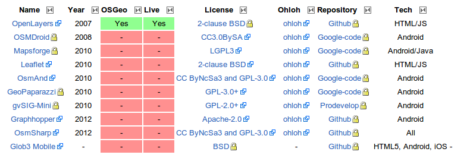

********************
Dispositivos móviles
********************

Autores
------------

- |shiguera|

Introducción
------------

Incluiremos en la categoría de dispositivos móviles los paquetes de software que se pueden utilizar desde *smartphones* y tabletas.  

La posibilidad de disponer de GPS en los dispositivos móviles, ha convertido a estos aparatos en herramientas muy valiosas para su utilización como navegadores, plataformas de geomarketing, sensores móviles, y en general como plataforma para todo tipo de aplicaciones en los que la geolocalización sea un componente de valor.

Actualmente existen dos sistemas operativos para dispositivos móviles que abarcan la gran mayoría de los dispositivos funcionando: Android e iOS. El primero, Android, es el más abierto de los dos, y dispone de un buen número de aplicaciones y librerías que sí se ofrecen en modalidad Open Source permitiendo su utilización en desarrollos ulteriores.

En ambos casos el sistema operativo subyacente es Linux. En los dispositivos iOS se utiliza una variante del lenguaje C para programarlos: el Objective C. En los dispositivos Android se utiliza una variante del lenguaje Java para programarlos.

Vamos a centrar este artículo en el software y librerías disponible para dispositivos basados en Android, por ser a día de hoy el que dispone de suficientes herramientas con licencias libres para ser utilizadas en el desarrollo de aplicaciones para móviles.

Software
--------
El sistema operativo Android permite utilizar una variante del lenguaje Java para programar los dispositivos móviles. En este sentido, muchas de las librerías Java disponibles para ordenadores de escritorio se pueden utilizar bajo condiciones de operación Android. Sería el caso, por ejemplo, de la librería *Java Topology Suite (JTS)*, que ha sido tratada en la sección correspondiente a librerías.

Existen por otra parte librerías específicas desarrolladas para Android, como es el caso de *Mapsforge*, pensada para visualizar información cartográfica en dispositivos Android. 

La utilización de Java permite también que librerías inicialmente pensadas para ser utilizadas en dispositivos móviles puedan ser reutilizadas en ordenadores de escritorio bajo entorno Java. En general la diferencia está en la parte gráfica de Java: En el caso de ordenadores de escritorio es usual utilizar el entorno Swing que no es compatible con Android. 

   Información general sobre tecnologías

Las principales librerías y programas disponibles en código abierto son:

OpenLayers_ y LeafLet_: 

En ambos casos se trata de librerías Javascript cuyo objetivo es la visualización de información cartográfica en entornos de Web-mapping. Los dispositivos móviles disponen de navegadores que interpretan el Javascript, por lo que, en general, es posible utilizar las librerías Javascript para visualizaciones desde dispositivos móviles, sean estos Android, iOS u otros. Las páginas web basadas en OpenLayers o Leaflet permiten su visualización en dispositivos móviles a través del navegador. En el caso de OpenLayers versión 2 hay que tener algunas precauciones al programar las páginas. La futura versión 3 de OpenLayers superará estas limitaciones. El funcionamiento de estas librerías se ha tratado en la sección correspondiente a Librerías.

OSMDroid_: 

El objetivo de OSMDroid es proporcionar una librería Java-Android para visualizar mapas en dispositivos Android. Ofrece una clase MapView para sustituir a la que viene de serie en Android que permite la visualización de tiles de OpenStreetMap. Se pueden visualizar tiles en modo on-line y en modo off-line. También proporciona clases para visualizar e interactuar con overlays, marcadores y otros.

MapsForge_: 

Mapsforge es una librería Open Source que permite gestionar la visualización de mapas de OpenStreetMap en los dispositivos Android. Es ligera, ocupa unos 300 Kb. Los mapas tienen un formato vectorial binario que los hace también ligeros. Utiliza un elemento MapView similar al del API de Google. Tiene una buena API para overlays (capas vectoriales superpuestas). Se pueden personalizar los estilos de renderización de los mapas. Tiene una herramienta para crear mapas a medida a través de Osmosis_. Algunos puntos débiles serían que no dispone de API para Bubbles y no limita la extensión del mapa.

OsmAnd_: 

Es una herramienta de navegación y routing para trabajar desde dispositivos Android con cartografía procedente de OpenStreetMap. Puede trabajar online y offline, previa descarga de los mapas. Proporciona instrucciones de navegación de forma visual y mediante voz sintetizada. La navegación y el routing es adaptable a vehículos automóviles, bicicletas o peatones. Permite mostrar la posición GPS del dispositivo y su orientación sobre la cartografía. Se puede mostrar el mapa orientado con el Norte arriba o en modo *head-up* o *proa-arriba*.  

GeoPaparazzi_: 

Permite tomar fotografías y notas georeferenciadas desde dispositivos Android, para poder ser visualizadas posteriormente con otras herramientas GIS. También proporciona una herramienta de tracking durante los recorridos.

gvSIGMini_: 

Es un cliente visualizador de cartografía para Android. Proporciona clientes WMS y WMS-C. Permite la búsqueda de direcciones y el cálculo de rutas. Trabaja en modo on-line y off-line. Se pueden superponer varias capas. Proporciona funciones de navegación GPS y posicionamiento por GPS o por red telefónica. Se puede compartir la posición a través de las redes sociales (Twitter, Facebook)  o por SMS y eMail. Permite la integración de *Street View*.

Graphhopper_: 

Es una herramienta de routing que trabaja con datos de OpenStreetMap. Se puede utilizar desde dispositivos Android, a través de su integración con MapsForge. También es posible utilizarlo desde páginas web como un servicio mediante llamadas HTTP desde Java o Javascript. Desde aplicaciones Java de escritorio es posible trabajar con Graphhopper en modo off-line. Se pueden calcular rutas para automóviles, bicicletas o paseos andando. También se pueden crear vehículos personalizados.

OsmSharp_: 

Es una herramienta para trabajar con cartografía de OpenStreetMap. Permite la visualización de información vectorial y el cálculo de rutas. Se puede utilizar en Android, iOS y WindowsPhone, así como en Linux, Windows y OSX.

Puntos calientes
----------------
Actualmente hay dos sistemas operativos para móviles que acaparan la mayoría de los dispositivos utilizados. Se trata del sistema iOS de Apple y el sistema Android de Google. El más '*abierto*' es el sistema operativo Android, si bien ninguno de los dos es realmente abierto.

Es importante destacar que, cuando el dispositivo móvil utiliza un navegador web para visualizar información en la red, la distinción entre dispositivos móviles y ordenadores de escritorio se hace más difusa, pues las mismas herramientas y librerías nos sirven para visualizar información en un dispositivo móvil u otro tipo de elemento de computación. Es el caso de las librerías OpenLayers o LeafLet, que nos permiten, con pequeñas diferencias, acceder a la visualización de información cartográfica desde cualquier navegador, sea este basado en móviles o en ordenadores de escritorio.

Otro frente actual es el de los sistemas operativos que tratan de ser funcionales tanto en dispositivos móviles como en ordenadores de escritorio. En esta categoría se incuyen el sistema operativo Ubuntu móvil o el Windows 8 que permiten ser ejecutados en todo tipo de ordenadores. Es previsible que el aumento de potencia de los dispositivos móviles unido a la conveniencia de compatibilidad entre dispositivos, permita en un futuro cercano que la distinción entre sistemas operativos para dispositivos móviles y para ordenadores de escritorio se haga cada vez más difusa.

Curva de aprendizaje y conocimientos previos
--------------------------------------------

La programación de los dispositivos Android se realiza a través de un lenguaje Java propio de Android. Muchas de las librerías disponibles para Java funcionan también en dispositivos Android. Es necesario conocer los fundamentos básicos de la programación Java y, además, conocer la forma de utilizar Java en Android. No es un lenguaje sencillo y además la variedad de dispositivos y de tamaños de pantallas hace un poco más complicada la programación.

Conocidos los fundamentos de la programación en Android, es posible utilizar las herramientas descritas anteriormente con un pequeño esfuerzo adicional que permita conocer cada una de ellas.

Documentación
-------------

.. list-table:: Documentación de proyectos
   :widths: 12 15 15 30
   :header-rows: 1

   * - Proyecto
     - Home
     - Documentación
     - Otros

   * - **OpenLayers**
     - `OpenLayers Home <http://openlayers.org/>`_
     - `Documentation <http://trac.osgeo.org/openlayers/wiki/Documentation>`_
     - `OL OSGeoLive Quickstart <http://live.osgeo.org/en/quickstart/openlayers_quickstart.html>`_

   * - **LeafLet**
     - `Leaflet Home <http://leafletjs.com/>`_
     - `Tutorials <http://leafletjs.com/examples.html>`_
     - `OSGeoLive Quickstart <http://live.osgeo.org/en/quickstart/leaflet_quickstart.html>`_

   * - **OSMDroid**
     - `Repository <https://github.com/osmdroid/osmdroid>`_
     - `How to get... <https://code.google.com/p/osmdroid/wiki/HowToIncludeInYourProject>`_
     - `[Article: AndroCode] <http://androcode.es/tag/osmdroid/>`_

   * - **MapsForge**
     - `Mapsforge Home <https://code.google.com/p/mapsforge/>`_
     - `Mapsforge 0.3.0 Javadoc <http://mapsforge.googlecode.com/git-history/0.3.0/javadoc/index.html>`_
     - `Taller Mapsforge Sigte 2013 <http://mercatorlab.com/geoinquietos/tallermapsforge/>`_

   * - **OsmAnd**
     - `OsmAnd Home <http://osmand.net/>`_
     - `OsmAnd repository <https://code.google.com/p/osmand/>`_
     - ...

   * - **Geopaparazzi**
     - `Geopaparazzi Home <http://geopaparazzi.github.io/geopaparazzi/>`_
     - `Geopaparazzi Documentation <https://github.com/geopaparazzi/geopaparazzi/wiki>`_ 
     - ...

   * - **gvSIG-Mini**
     - `gvSIG-Mini Home <https://confluence.prodevelop.es/display/GVMN/Home>`_
     - `gvSIG-Mini Documentation <https://confluence.prodevelop.es/display/GVMN/Documentation>`_ 
     - ...

   * - **Graphhopper**
     - `Graphhopper Home <http://graphhopper.com/>`_
     - `Quickstart users <https://github.com/graphhopper/graphhopper/wiki/QuickStart>`_ 
     - `Quickstart developpers <https://github.com/graphhopper/graphhopper/wiki/Developers>`_

   * - **OsmSharp**
     - `OsmSharp Home <http://www.osmsharp.com/>`_
     - `OsmSharp documentation <http://www.osmsharp.com/wiki/documentation>`_ 
     - ...

   

.. Enlaces
.. _OpenLayers: http://docs.openlayers.org/

.. _LeafLet: http://leafletjs.com/index.html

.. _OsmAnd: http://osmand.net/

.. _GeoPaparazzi: http://geopaparazzi.github.io/geopaparazzi/

.. _gvSIGMini: https://confluence.prodevelop.es/display/GVMN/Documentation

.. _Graphhopper: http://graphhopper.com/#overview

.. _OSMDroid: https://code.google.com/p/osmdroid/

.. _OsmSharp: https://github.com/xivk/OsmSharp

.. _MapsForge: https://code.google.com/p/mapsforge/

.. _Osmosis: http://wiki.openstreetmap.org/wiki/Osmosis
