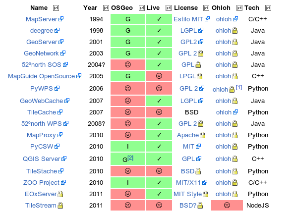

**********
Servidores
**********

Autores
---------------

- |alediator|
- |delawen|
- |jsanz|

Introducción
---------------

En esta sección se va a abordar el amplio conjunto de proyectos correspondientes a la capa intermedia de cualquier sistema de información, también conocida como *middleware*. En esta sección se cubre por tanto cualquier aplicación que se ejecuta en un servidor y que tiene como objetivo proporcionar uno o más servicios que serán consumidos por clientes, independientemente de si estos son otras aplicaciones de servidor, clientes *web*, clientes de escritorio o dispositivos móviles.

¿Qué tipos de servicios actualmente se ofrecen relacionados con la |IG|? Una agrupación funcional podría agruparlos en las siguientes categorías:

- **Servidores de mapas**: Encargados de renderizar datos tanto vectoriales como *raster* en diferentes estilos y proyecciones cartográficas, en general cumpliendo el estándar `WMS de OGC`_
- **Servidores de teselas**: Una variante del anterior es aquellos servidores que ofrecen la cartografía renderizada únicamente en juegos de teselas con un número limitado de resoluciones, casi siempre además empleando sistemas de almacenamiento intermedio (*caches*). En este caso hay dos estándares en el sector, el estándar `TMS`_ y el `WMTS de OGC`_
- **Servidores de datos brutos**: Al contrario que las categorías anteriores, estos servidores ofrecen la cartografía vectorial o *raster* en formatos que deben luego ser procesados por los clientes para la tarea para la que estén desarrollados, tanto si es para su análisis como su visualización. Los estándares de comunicación son `WFS`_ y `WCS`_ respectivamente para datos vectoriales y *raster*. En esta categoría se podrían incluir  también a los servidores relacionados con la publicación de datos de sensores, en todo el abanico de estándares OGC englobados en lo que se conoce como `Sensor Web Enablement`_
- **Servidores de metadatos**: Estos servidores implementan estándares de descubrimiento de datos como `CSW`_. Mediante estos servidores usuarios y otros componentes pueden encontrar juegos de datos y otros servicios mediante protocolos estandarizados. Estos servidores son el corazón de las Infraestructuras de Datos Espaciales.
- **Servidores de geoprocesos**: Estos servidores exponen operaciones de análisis, que pueden partir de datos directamente disponibles en el servidor o bien acceder a otros servidores de datos brutos para encadenar servicios que realicen flujos de geoprocesamiento de todo tipo. El estándar de OGC para geoprocesamiento es el `WPS`_.

.. _WMS de OGC: http://www.opengeospatial.org/standards/wms
.. _TMS: https://en.wikipedia.org/wiki/Tile_Map_Service
.. _WMTS de OGC: http://www.opengeospatial.org/standards/wmts
.. _WFS: http://www.opengeospatial.org/standards/wfs
.. _WCS: http://www.opengeospatial.org/standards/wcs
.. _CSW: http://www.opengeospatial.org/standards/cat
.. _WPS: http://www.opengeospatial.org/standards/cat
.. _Sensor Web Enablement: http://www.opengeospatial.org/ogc/markets-technologies/swe

Es habitual que un producto de |sl| cubra más de una funcionalidad de las definidas en la categorización anterior, especialmente con los proyectos más veteranos. La interoperabilidad es otra de las características del |sl| geoespacial y es por ello que la mayoría de los productos suelen intentar implementar aquellos estándares que afectan a su área de interés.

En la siguiente tabla se presentan las características principales de los productos revisados en el contexto de este trabajo. Se puede consultar más información sobre la estructura de la tabla en la  :ref:`introducción <info-tabla>`.

   Información general sobre servidores

.. figure:: imgs/estandares.png
   :align: center
   :alt: Implementación de estándares OGC

   Implementación de estándares OGC

.. important:: Se puede consultar la versión más reciente, así como los enlaces asociados y anotaciones en la sección de `Servidores`_ del wiki de OSGeo.

.. _Servidores: http://wiki.osgeo.org/wiki/Panorama_SIG_Libre_2014/Servidores

Software
----------

En esta sección se describirá brevemente cada uno de los productos evaluados en esta comparativa. El orden de aparición es cronológico, empezando por los proyectos más veteranos.

MapServer_:
  Probablemente el servidor de mapas más usado en el mundo sigue desarrollándose sin pausa, incorporando en los últimos años nuevos subproyectos como `MapCache`_ y `TinyOWS`_. Su configuración sigue siendo mediante ficheros de texto aunque aparecen nuevas interfaces para facilitar su edición como `MapManager`_. Sigue destacando de este servidor su ligereza y facilidad de despliegue (si no se necesita soporte para formatos privativos).

  .. _MapCache: http://www.mapserver.org/trunk/mapcache/index.html
  .. _TinyOWS: http://mapserver.org/trunk/tinyows/
  .. _MapManager: http://www.gisinternals.com/MapManager/
deegree_:
  Este servidor de mapas con una comunidad principalmente alemana soporta una gran cantidad de estándares. Este servidor se caracterizó durante mucho tiempo por su ardua configuración, cosa que está cambiando gracias al esfuerzo puesto en desarrollar una consola *web* para los servicios y una documentación mucho más detallada.
GeoServer_:
  GeoServer es un proyecto ejemplar por su activa comunidad, frecuentes actualizaciones e innovaciones más allá de la implementación de gran parte de los estándares OGC existentes. Sus extensiones al estándar SLD, el soporte de estilos CSS, el buen soporte para multitud de orígenes de datos y su amigable interfaz lo convierten en un servidor de mapas ampliamente utilizado en todo tipo de contextos, especialmente en grandes instalaciones.
GeoNetwork_:
  El servidor de metadatos más utilizado en el sector sigue ofreciendo actualizaciones y mejoras constantes gracias al apoyo tanto de las empresas que lo desarrollan como de las administraciones públicas que lo utilizan, haciendo de este servidor la primera opción a la hora e implementar un nodo de una Infraestructura de Datos Espaciales, con múltiples referencias y casos de éxito.
`52ºnorth SOS`_:
  Probablemente la implementación más relevante del principal estándar OGC sobre sensores. No dispone de una interfaz de usuario salvo una sencilla consola para ejecutar consultas de ejemplo. La última versión (4.0) implementa la versión más reciente del estándar SOS, la 2.0.
`MapGuide`_:
  El servidor liberado por AutoDesk siempre se ha vinculado a entornos Windows (aunque aparentemente puede funcionar en Linux) y su falta de soporte para estándares OGC parece que le ha dejado atrás en el panorama de |sl|. Pese a todo, es el único servidor de mapas que integra completos visores y se puede considerar una solución completa, aunque en general se prefieran entornos desacoplados donde el uso de estándares facilite desarrollar clientes personalizados.
PyWPS_:
  Este pequeño servidor WPS se ha reescrito durante el último año y pretende ofrecer una interfaz ligera en la que desarrollar geoprocesos en el popular lenguaje de programación Python. La creciente comunidad geoespacial alrededor de este lenguaje de programación y por lo tanto, una cada vez mayor oferta de componentes que ofrecen funcionalidad pueden hacer este producto interesante.
GeoWebCache_:
  GeoWebCache nació como un proyecto dentro del programa de becas de verano de Google para estudiantes (*Google Summer of Code*). El objetivo era cubrir la necesidad en GeoServer_ de un servidor de teselas que permita pregenerar y acelerar la cartografía servida por este producto. Con el tiempo ha ido creciendo en funcionalidad y se puede considerar un producto independiente, aunque en general se utilice conjuntamente con GeoServer. Al igual que GeoServer, destaca por su cómoda interfaz de usuario, capacidad para limitar en disco las *caches*, generación y borrado de las mismas, etc.
TileCache_:
  Durante mucho tiempo TileCache_ fue la implementación de referencia del estándar *de facto* TMS. El proyecto lleva ya bastante tiempo estancado sin prácticamente actividad por lo que se puede considerar en periodo de *senectud* y no sería aconsejable instalarlo en nuevos proyectos.
`52ºnorth WPS`_:
  Este servidor de procesos dispone de una sencilla interfaz y conectores para implementar geoprocesos en el lenguaje de programación `R`_, usar procesos del GIS de escritorio GRASS_, o de SEXTANTE_.

  .. _R: http://www.r-project.org/
  .. _GRASS: http://grass.osgeo.org/
  .. _SEXTANTE: http://www.sextantegis.com/

MapProxy_:
  MapProxy es un servidor de teselas que dispone de algunas características interesantes. Al igual que GeoWebCache_ permite responder a cualquier petición WMS, no solo a las correspondientes con teselas de las *caches* definidas. Además dispone de varios mecanismos de almacenamiento de teselas más allá del uso del sistema de ficheros. Además puede usarse como un servidor de mapas estándar para ficheros de configuración de la biblioteca de renderización Mapnik_. Su configuración mediante sencillos ficheros de texto y las herramientas de ayuda a configuración y despliegue de las mismas lo convierten en un producto ciertamente versátil.

  .. _Mapnik: http://mapnik.org/

PyCSW_:
  Servidor de metadatos desarollado en el lenguaje Python, diseñado para ser tanto una librería como un servidor independiente, por lo que se puede integrar en otros desarrollos o desplegar como un servidor. Es un proyecto pequeño, reciente y sin interfaz de usuario. Se puede arrancar el servidor importando una carpeta de ficheros XML de metadatos y utiliza una base de datos, implementando el estándar CSW (entre otros) para acceso a los metadatos y los estándares OGC más importantes para recopilar metadatos de servicios existentes. Este servidor se ha integrado en productos más grandes como son el servidor de *Open Data* CKAN_ y el portal de datos geográficos GeoNode_.

  .. _CKAN: http://ckan.org/
  .. _GeoNode: http://geonode.org/

`QGIS Server`_:
  Este servidor nace en el contexto del proyecto QGIS como una forma sencilla de exponer proyectos de este *software* de escritorio a través de la red y mediante los estándares WMS y WFS. Técnicamente es un producto escrito en C++ que se despliega como un servidor FastCGI/CGI (como MapServer_) y que proporciona un plugin para el software de escritorio de tal forma que se facilita enormemente la publicación de datos geográficos desde este producto.

TileStache_:
  Servidor de teselas heredero del veterano TileCache_, desarrollado para mejorar las funcionalidades de éste, aunque no ha tenido mucha actividad en los últimos meses. Sus principales características son que está orientado a renderizar mapas a partir de ficheros de configuración de Mapnik_, generar teselas vectoriales en formato GeoJSON, puede almacenar las *caches* no solo en disco sino también en memoria o en Amazon S3.

`ZOO Project`_:
  Este proyecto consiste en un núcleo escrito en C++ que permite ejecutar los procesos en diferentes lenguajes y para cualquier propósito, un conjunto de servicios a modo de ejemplo que escritos en diferentes lenguajes de programación y utilizando librerías bien conocidas realizan diferentes procesos como el cálculo de rutas, conversión de datos, etc. Finalmente el proyecto proporciona una interfaz de programación (API) escrita en JavaScript para ejecutar procesos WMS desde el servidor. Este proyecto se integra muy bien con MapServer_ para generar servicios WMS dinámicos a partir del resultado de procesos WPS de forma que el *software* ofrece directamente un método de visualización de los resultados.

EOxServer_:
  Este *software* es básicamente una aplicación *web* escrita en el *framework* Django_, que permite modelar juegos de datos de observación de la Tierra, utilizando y extendiendo MapServer_ para ofrecer servicios WMS y WCS de estos datos así como una interfaz de visualización, consulta y administración en un entorno *web*. A partir de un conjunto de imágenes *raster* de diferentes áreas e instantes temporales, EOxServer además de exponerlas por WMS y WCS usando el perfil específico para datos de observación de la Tierra, ofrece servicios para generar mosaicos y previsualizaciones, mediante un entorno web (usando OpenLayers) para navegar por las diferentes fechas y regiones.

  .. _Django: https://www.django-cms.org/en/

TileStream_:
  TileStream es un servidor de teselas pensado para servir archivos MBTiles_. Es decir no genera ningún tipo de *cache* ni se conecta con servicios para solicitar las imágenes como el resto de servidores. Se trata de un *software* limitado únicamente a servir teselas almacenadas en este tipo de bases de datos. El *hosting* de teselas de Mapbox_ usa una variante de este servidor para su servicio.

  .. _Mapbox: https://www.mapbox.com/
  .. _MBTiles: https://github.com/mapbox/mbtiles-spec

Puntos calientes
--------------------

Este área del |sl| geoespacial está en continua evolución, pese a que la complejidad inherente a desarrollar este tipo de productos es elevada y hace algún tiempo que no aparece ningún producto relevante. Así y todo los proyectos existentes en general gozan de buena salud y no dejan de actualizarse e innovar.

En el área de los servidores de mapas la mejora del rendimiento y en especial de las capacidades de simbolización han facilitado la aplicación de estos productos en proyectos cada vez más complejos, como en el caso del uso de GeoServer_ en el Instituto Geográfico Francés [GeoServerIGN]_. La innovación de aplicar al área de la cartografía un lenguaje de definición de simbologías análogo a las hojas de estilo de las páginas *web* (el estándar CSS_) va a facilitar a los especialistas diseñar y mantener los estilos de sus mapas de una forma mucho más sencilla y a la vez expresiva.

.. _CSS: http://www.w3.org/Style/CSS/

En cuanto a los servidores de geoprocesamiento, la capacidad para definir procesos de análisis geográfico utilizando lenguajes de programación de alto nivel, como Python o JavaScript entre otros, va a facilitar la inevitable transición de este tipo de procesos desde los clientes de escritorio a los servidores. Así, proyectos como `ZOO Project`_ o el uso de `GeoScript`_ en `GeoServer`_ ponen a disposición de los analistas un entorno de trabajo que soporta varios lenguajes con un rendimiento elevado y en un entorno distribuido.

.. _GeoScript: http://geoscript.org/

Los servidores de teselas siguen siendo de momento un *mal necesario* para ofrecer un rendimiento adecuado en proyectos con cartografía que no sufre actualizaciones frecuentes, imágenes *raster* o simplemente que no necesitan estilos dinámicos. Esta situación en cualquier caso para la información vectorial se percibe como transitoria ya que están empezando a aparecer productos y servicios que optimizan la presentación de cartografía sirviéndola en un formato vectorial junto con los estilos, siendo responsabilidad del cliente la renderización de la misma. Esta variante permite ofrecer cartografía mucho más dinámica tanto en su componente temporal como en la de la simbolización.

Finalmente en el área de los servicios de descubrimiento el desarrollo de GeoNetwork_, el principal servidor de metadatos libre, sigue activo y van apareciendo nuevas alternativas y variantes como el soporte del protocolo CSW por parte de GeoServer, así como la aparición del proyecto PyCSW_ y su integración en otros productos.

Curva de aprendizaje y conocimientos previos
------------------------------------------------

Principalmente existen dos perfiles de técnicos a la hora de trabajar con este tipo de productos. Esto se debe a que la implantación de un servicio en la red en primer lugar necesita de especialistas en sistemas que se encarguen de una correcta instalación del producto, adaptación del sistema operativo y de la red a la que se conecta, otros sistemas que puedan afectar al mismo, configuración y acceso a bases de datos, etc. Por otro lado igualmente en general es necesaria la intervención de un técnico especializado en el área geoespacial para la configuración avanzada del producto, preparar la cartografía o bases de datos a ofrecer, generar metadatos, etc. Es habitual que técnicos de un único perfil hagan todo el trabajo pero como en cualquier proyecto geoespacial, es en la multidisciplinariedad de los equipos de trabajo donde mejores resultados se van a conseguir.

Por lo tanto los conocimientos necesarios para este amplio conjunto de productos y desde el punto de vista tanto de la administración de sistemas como de la |IG| es elevado, aunque puede depender también del producto. Nombrando los más importantes:

Desde el punto de vista de la administración de sistemas:
  * Instalación y configuración de servidores *web* y de aplicaciones.
  * Configuración de aplicaciones FastCGI/CGI, WSGI, NodeJS, JEE, etc. en función del producto.
  * Creación y configuración de :ref:`bases de datos`, esquemas de datos, usuarios y roles, etc.
  * Configurar *caches*, *proxies* inversos y reescritura de direcciones *web* para integrar varios servidores. Por ejemplo es habitual exponer un servidor de aplicaciones JEE (por ejemplo GeoNetwork_ ejecutándose en el contenedor de *servlets* Tomcat) detrás de un servidor web, e incluso éste último detrás de un acelerador web como Varnish.

Desde el punto de vista del técnico en tecnologías geoespaciales:
  * Conversión de formatos de datos geográficos (*raster* y vectorial).
  * Manejo y carga de bases de datos espaciales.
  * Conocer los diferentes especificaciones OGC, tanto en protocolos como en formatos (en función del producto).
  * Comprender las principales proyecciones cartográficas y sistemas de referencia.
  * Comprender las diferencias entre los diferentes formatos de imagen soportados por los navegadores, el concepto de *cache*, etc.

Documentación
---------------

A continuación se ofrecen enlaces a las principales páginas de documentación, tutoriales o ejemplos que pueden ayudar a empezar a trabajar con cada uno de los productos revisados.

* **MapServer**: `documentación <http://mapserver.org/documentation.html>`_, `quickstart de OSGeo Live <http://live.osgeo.org/en/quickstart/mapserver_quickstart.html>`_.

* **deegree**: `documentación <http://download.occamlabs.de/documentation/3.3.8/html/>`_, `quickstart de OSGeo Live <http://live.osgeo.org/en/quickstart/deegree_quickstart.html>`_.

* **GeoServer**: `documentación <http://docs.geoserver.org/stable/en/user/>`_, `quickstart de OSGeo Live <http://live.osgeo.org/en/quickstart/geoserver_quickstart.html>`_, `taller de introducción de Boundless <http://workshops.boundlessgeo.com/geoserver-intro/>`_.

* **GeoNetwork**: `documentación <http://geonetwork-opensource.org/docs.html>`_, `quickstart de OSGeo Live <http://live.osgeo.org/en/quickstart/geonetwork_quickstart.html>`_.

* **52ºnorth SOS**: `documentación <https://wiki.52north.org/bin/view/SensorWeb/SensorObservationServiceIVDocumentation>`_, `quickstart de OSGeo Live <http://live.osgeo.org/en/quickstart/52nSOS_quickstart.html>`_.

* **MapGuide**: `documentación <https://mapguide.osgeo.org/GettingStartedResources>`_, `quickstart de OSGeo Live <http://live.osgeo.org/en/quickstart/mapguide_quickstart.html>`_.

* **PyWPS**: `documentación <http://pywps.wald.intevation.org/documentation/pywps-3.2/>`_, `tutorial <http://pywps.wald.intevation.org/documentation/course/>`_.

* **GeoWebCache**: `documentación <http://geowebcache.org/docs/1.5.1/>`_, `taller de Boundless <http://workshops.boundlessgeo.com/suiteintro/geowebcache/index.html>`_.

* **TileCache**: `documentación <http://tilecache.org/docs/README.html#>`_.

* **52ºnorth WPS**: `tutoriales <https://wiki.52north.org/bin/view/Geoprocessing/GeoprocessingTutorials>`_, `quickstart de OSGeo Live <http://live.osgeo.org/en/quickstart/52nWPS_quickstart.html>`_.

* **MapProxy**: `documentación <http://mapproxy.org/docs/latest/>`_, `quickstart de OSGeo Live <http://live.osgeo.org/en/quickstart/mapproxy_quickstart.html>`_.

* **PyCSW**: `documentación <http://pycsw.org/docs/latest/>`_, `quickstart de OSGeo Live <http://live.osgeo.org/en/quickstart/pycsw_quickstart.html>`_, `taller <http://geopython.github.io/pycsw-workshop/>`_.

* **QGIS Server**: `tutorial <https://hub.qgis.org/projects/quantum-gis/wiki/QGIS_Server_Tutorial>`_, `quickstart de OSGeo Live <http://live.osgeo.org/en/quickstart/qgis_mapserver_quickstart.html>`_.

* **TileStache**: `documentación <http://tilestache.org/doc/>`_.

* **ZOO Project**: `documentación <http://zoo-project.org/docs/>`_, `quickstart de OSGeo Live <http://live.osgeo.org/en/quickstart/zoo-project_quickstart.html>`_, `taller del FOSS4G2013 <http://zoo-project.org/ws2013n/>`_.

* **EOxServer**: `documentación <https://eoxserver.org/doc/en/users/index.html>`_, `quickstart de OSGeo Live <http://live.osgeo.org/en/quickstart/eoxserver_quickstart.html>`_.

* **TileStream**: `notas de instalación y uso <https://github.com/mapbox/tilestream>`_

.. list-table:: Documentación de proyectos
   :widths: 10 10 10 35
   :header-rows: 1

   * - Proyecto
     - Documentación
     - OSGeo Live
     - Otros

   * - **MapServer**
     - `MapServer docs <http://mapserver.org/documentation.html>`_
     - `MapServer qs <http://live.osgeo.org/en/quickstart/mapserver_quickstart.html>`_
     -

   * - **deegree**
     - `deegree docs <http://download.occamlabs.de/documentation/3.3.8/html/>`_
     - `deegree qs <http://live.osgeo.org/en/quickstart/deegree_quickstart.html>`_
     -

   * - **GeoServer**
     - `GeoServer docs <http://docs.geoserver.org/stable/en/user/>`_
     - `GeoServer qs <http://live.osgeo.org/en/quickstart/geoserver_quickstart.html>`_
     - `taller de introducción <http://workshops.boundlessgeo.com/geoserver-intro/>`_

   * - **GeoNetwork**
     - `GeoNetwork docs <http://geonetwork-opensource.org/docs.html>`_
     - `GeoNetwork qs <http://live.osgeo.org/en/quickstart/geonetwork_quickstart.html>`_
     -

   * - **52ºnorth SOS**
     - `52ºnorth SOS docs <https://wiki.52north.org/bin/view/SensorWeb/SensorObservationServiceIVDocumentation>`_
     - `52ºnorth SOS qs <http://live.osgeo.org/en/quickstart/52nSOS_quickstart.html>`_
     -

   * - **MapGuide**
     - `MapGuide docs <https://mapguide.osgeo.org/GettingStartedResources>`_
     - `MapGuide qs <http://live.osgeo.org/en/quickstart/mapguide_quickstart.html>`_
     -

   * - **PyWPS**
     - `PyWPS docs <http://pywps.wald.intevation.org/documentation/pywps-3.2/>`_
     -
     - `PyWPS tutorial <http://pywps.wald.intevation.org/documentation/course/>`_

   * -  **GeoWebCache**
     - `GeoWebCache docs <http://geowebcache.org/docs/1.5.1/>`_
     -
     -  `taller de Boundless <http://workshops.boundlessgeo.com/suiteintro/geowebcache/index.html>`_

   * - **TileCache**
     - `TileCache README <http://tilecache.org/docs/README.html#>`_
     -
     -

   * - **52ºnorth WPS**
     -
     - `52ºnorth WPS qs <http://live.osgeo.org/en/quickstart/52nWPS_quickstart.html>`_
     - `tutoriales de 52ºnorth WPS <https://wiki.52north.org/bin/view/Geoprocessing/GeoprocessingTutorials>`_

   * - **MapProxy**
     - `MapProxy docs <http://mapproxy.org/docs/latest/>`_
     - `MapProxy qs <http://live.osgeo.org/en/quickstart/mapproxy_quickstart.html>`_
     -

   * - **PyCSW**
     - `PyCSW docs <http://pycsw.org/docs/latest/>`_
     - `PyCSW qs <http://live.osgeo.org/en/quickstart/pycsw_quickstart.html>`_
     - `taller de PyCSW <http://geopython.github.io/pycsw-workshop/>`_

   * - **QGIS Server**
     -
     - `QGIS Server qs <http://live.osgeo.org/en/quickstart/qgis_mapserver_quickstart.html>`_
     - `tutorial de QGIS Server <https://hub.qgis.org/projects/quantum-gis/wiki/QGIS_Server_Tutorial>`_

   * - **TileStache**
     - `TileStache docs <http://tilestache.org/doc/>`_
     -
     -

   * -  **ZOO Project**:
     - `ZOO Project docs <http://zoo-project.org/docs/>`_
     - `ZOO Project qs <http://live.osgeo.org/en/quickstart/zoo-project_quickstart.html>`_
     - `taller del FOSS4G2013 <http://zoo-project.org/ws2013n/>`_

   * - **EOxServer**
     - `EOxServer docs <https://eoxserver.org/doc/en/users/index.html>`_
     - `EOxServer qs <http://live.osgeo.org/en/quickstart/eoxserver_quickstart.html>`_
     -

   * - **TileStream**
     - `notas de instalación y uso <https://github.com/mapbox/tilestream>`_
     -
     -

Referencias
---------------

.. [GeoServerIGN] `Using GeoServer at IGN (the French National Mapping Agency) to create new digital maps <http://blog.geoserver.org/2014/01/07/using-geoserver-at-ign-the-french-national-mapping-agency-to-create-new-digital-maps/>`_

.. Enlaces a webs de  proyectos

.. _MapServer: http://mapserver.org
.. _deegree: http://deegree.org/
.. _GeoServer: http://geoserver.org
.. _GeoNetwork: http://geonetwork-opensource.org/
.. _52ºnorth SOS: http://52north.org/communities/sensorweb/
.. _MapGuide: http://mapguide.osgeo.org/
.. _PyWPS: http://pywps.wald.intevation.org/
.. _GeoWebCache: http://geowebcache.org/
.. _TileCache: http://tilecache.org/
.. _52ºnorth WPS: http://52north.org/communities/geoprocessing/wps/index.html
.. _MapProxy: http://mapproxy.org/
.. _PyCSW: http://pycsw.org/
.. _QGIS Server: http://docs.qgis.org/2.0/en/docs/user_manual/working_with_ogc/ogc_server_support.html
.. _TileStache: http://tilestache.org/
.. _ZOO Project: http://zoo-project.org/
.. _EOxServer: https://github.com/EOxServer/eoxserver
.. _TileStream: https://github.com/mapbox/tilestream
