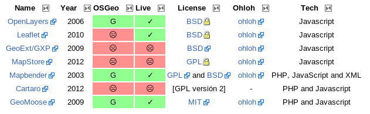

*************
*Web Mapping*
*************

.. todo:: Sección por completar. Discusión del contenido en la :issue:`3`

Autores
----------

- |alediator|
- |delawen|
- |moiarcsan|

Introducción
--------------

En esta sección se va a abordar el amplio conjunto de proyectos relacionados con la representación de la información geográfica en un cliente web y que tiene como objetivo la visualización y manipulación de la misma.

.. todo: Sección por completar

Puntos calientes
-------------------

.. note:: Dentro de la sección, hacia donde se está moviendo la comunidad.

Software
----------

Existen diferentes tecnologías para mostrar información geospacial en la web, de las que destacamos las que se aprecian en la siguiente tabla.

   Información general sobre tecnologías

.. figure:: imgs/estandares.png
   :align: center
   :alt: Implementación de estándares OGC

   Implementación de estándares OGC

.. important:: Se puede consultar la versión más reciente, así como los enlaces asociados y anotaciones en la sección de `Webmapping`_ del wiki de OSGeo.

.. _Servidores: http://wiki.osgeo.org/wiki/Panorama_SIG_Libre_2014/WebMapping

Curva de aprendizaje y conocimientos previos
-------------------------------------------------

.. note:: Metería otra tabla con los conocimientos previos necesarios para trabajar con y en cada software.

Documentación
---------------

.. note:: Enlace al wiki y quizás alguna sugerencia particular en alguna sección.

